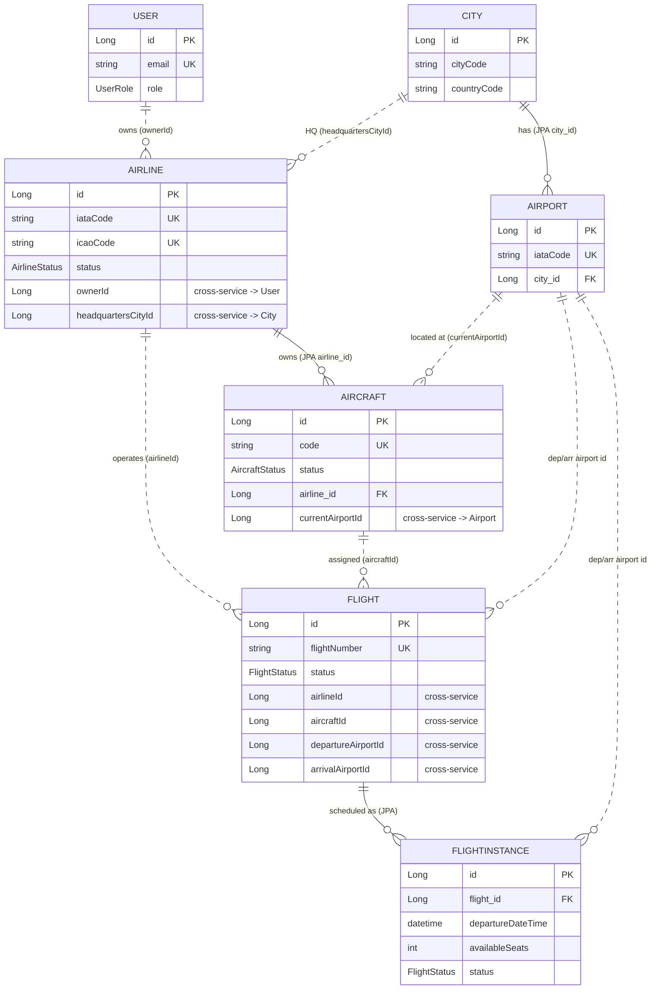

# Giải thích các Entity & Mối quan hệ trong hệ thống Airline

Tài liệu này mô tả vai trò của từng entity, các kiểu dữ liệu dùng chung (`common-lib`), và đặc biệt là **mối liên hệ giữa các entity** — bao gồm cả quan hệ JPA trực tiếp (trong cùng một service) lẫn tham chiếu chéo service (lưu bằng ID).

---

## 1. Kiến trúc tổng quan

Hệ thống theo mô hình **microservices**, mỗi service sở hữu một database riêng (database-per-service). Vì vậy có hai loại quan hệ:

| Loại quan hệ | Cách thể hiện | Ví dụ |
|---|---|---|
| **Trong cùng service** (same bounded context) | Quan hệ JPA trực tiếp `@ManyToOne` / `@JoinColumn` | `Aircraft → Airline`, `Airport → City` |
| **Chéo service** (cross-service) | Lưu khóa ngoại bằng **ID thô** (`Long`), không có FK ở DB | `Airline.ownerId → User`, `Flight.aircraftId → Aircraft` |

> Nguyên tắc: **không** tạo quan hệ JPA xuyên service. Một service chỉ giữ ID tham chiếu và gọi sang service kia (qua REST/feign) khi cần dữ liệu đầy đủ.

### Các service và entity sở hữu

| Service | Entity (model) | Vai trò |
|---|---|---|
| **user-service** | `User` | Quản lý người dùng & vai trò |
| **location-service** | `City`, `Airport` | Dữ liệu địa lý: thành phố và sân bay |
| **airline-core-service** | `Airline`, `Aircraft` | Hãng bay và đội tàu bay |
| **flight-ops-service** | `Flight`, `FlightInstance` | Định nghĩa chuyến bay & các chuyến bay thực tế theo lịch |

---

## 2. `common-lib` — Tài nguyên dùng chung

`common-lib` không chứa entity nghiệp vụ, mà chứa các thành phần được mọi service tái sử dụng để tránh trùng lặp (DRY) và đảm bảo nhất quán hợp đồng API.

### 2.1 Embeddable (`@Embeddable`) — nhúng vào bảng của entity

Đây là **value object**, không có bảng riêng; các cột của chúng được nhúng thẳng vào bảng của entity chứa nó.

| Embeddable | Trường | Được nhúng vào |
|---|---|---|
| `Address` | `street`, `postalCode` | `Airport` |
| `GeoCode` | `latitude`, `longitude` | `Airport` |
| `Support` | `email`, `phone`, `hours` | `Airline` |

### 2.2 Enum — trạng thái & vai trò

| Enum | Giá trị | Dùng bởi |
|---|---|---|
| `UserRole` | `ROLE_SYSTEM_ADMIN`, `ROLE_USER`, `ROLE_AIRLINE_OWNER` | `User.role` |
| `AirlineStatus` | `ACTIVE`, `INACTIVE`, `BANNED` | `Airline.status` |
| `AircraftStatus` | `ACTIVE`, `INACTIVE`, `MAINTENANCE`, `RETIRED` | `Aircraft.status` |
| `FlightStatus` | `SCHEDULED`, `BOARDING`, `DEPARTED`, `IN_AIR`, `LANDED`, `ARRIVED`, `DELAYED`, `CANCELLED`, `DIVERTED`, `COMPLETED` | `Flight.status`, `FlightInstance.status` |

### 2.3 Payload (request / response / dto)

`common-lib` còn chứa các DTO truyền giữa client ↔ service và giữa service ↔ service: `*Request`, `*Response`, `ApiResponse<T>` (envelope chuẩn), `AuthResponse`, `UserDto`, `AirlineDropdownItem`... Đây là **hợp đồng dữ liệu**, tách biệt hoàn toàn khỏi entity persistence.

---

## 3. Chi tiết từng Entity & vai trò

### 3.1 `User` (user-service)
Người dùng hệ thống. Định danh bằng `email` (unique). Có `role` (`UserRole`) phân quyền — đặc biệt `ROLE_AIRLINE_OWNER` là người sở hữu hãng bay.
- **Được tham chiếu bởi:** `Airline.ownerId`, `Airline.updatedById` (cross-service).

### 3.2 `City` (location-service)
Thành phố — đơn vị địa lý gốc. Chứa `cityCode`, `countryName`, `countryCode`, `timeZoneId`.
- **Quan hệ:** là phía "một" trong quan hệ với `Airport` (một thành phố có nhiều sân bay).

### 3.3 `Airport` (location-service)
Sân bay, định danh bằng `iataCode` (3 ký tự, unique). Nhúng `Address` và `GeoCode`.
- **Quan hệ JPA (trong service):** `@ManyToOne` tới `City` qua `city_id` (bắt buộc). → Nhiều `Airport` thuộc một `City`.
- **Được tham chiếu bởi (cross-service):** `Aircraft.currentAirportId`, `Flight.departureAirportId` / `arrivalAirportId`, `FlightInstance.departureAirportId` / `arrivalAirportId`.

### 3.4 `Airline` (airline-core-service)
Hãng hàng không. Định danh bằng `iataCode` (2 ký tự) và `icaoCode` (3 ký tự). Có `status` (`AirlineStatus`), nhúng `Support`.
- **Tham chiếu chéo service (lưu ID):**
  - `ownerId` → `User` (chủ sở hữu, bắt buộc, không đổi).
  - `updatedById` → `User` (người cập nhật gần nhất).
  - `headquartersCityId` → `City` (thành phố đặt trụ sở).
- **Được tham chiếu bởi:** `Aircraft.airline` (JPA, cùng service), `Flight.airlineId` (cross-service).

### 3.5 `Aircraft` (airline-core-service)
Tàu bay thuộc một hãng. Định danh bằng `code` (unique). Có cấu hình ghế theo hạng (`economySeats`, `businessSeats`...), `status` (`AircraftStatus`), và logic nghiệp vụ (`getTotalSeats()`, `isOperational()`, `requiresMaintenance()`).
- **Quan hệ JPA (trong service):** `@ManyToOne` tới `Airline` qua `airline_id` (bắt buộc). → Nhiều `Aircraft` thuộc một `Airline`.
- **Tham chiếu chéo service (lưu ID):** `currentAirportId` → `Airport` (vị trí hiện tại).
- **Được tham chiếu bởi:** `Flight.aircraftId` (cross-service).

### 3.6 `Flight` (flight-ops-service)
**Định nghĩa tuyến/chuyến bay** (template) — ví dụ "VN123 từ sân bay A đến sân bay B của hãng X". Định danh bằng `flightNumber` (unique). Có `status` (`FlightStatus`).
- **Tất cả quan hệ đều cross-service, lưu bằng ID:**
  - `airlineId` → `Airline`
  - `aircraftId` → `Aircraft`
  - `departureAirportId` / `arrivalAirportId` → `Airport`
- **Quan hệ JPA (trong service):** là phía "một" của `FlightInstance` (một `Flight` sinh ra nhiều `FlightInstance`).

### 3.7 `FlightInstance` (flight-ops-service)
**Chuyến bay thực tế theo ngày giờ cụ thể** sinh ra từ một `Flight`. Chứa `departureDateTime`/`arrivalDateTime`, `totalSeats`/`availableSeats` (quản lý chỗ ngồi), `status`, ràng buộc đặt vé (`minAdvanceBookingDays`...), và helper `getFormattedDuration()`.
- **Quan hệ JPA (trong service):** `@ManyToOne` tới `Flight`. → Nhiều `FlightInstance` thuộc một `Flight`.
- **Tham chiếu chéo service (lưu ID):** `airlineId`, `departureAirportId`, `arrivalAirportId`, `scheduleId` (lịch khai thác).

---

## 4. Sơ đồ quan hệ

> Ghi chú ký hiệu: `||--o{` = quan hệ **JPA trực tiếp** (cùng service, có FK trong DB); `||..o{` = **tham chiếu chéo service** (chỉ lưu ID, không có FK).

---

## 5. Tóm tắt mối liên hệ

| Từ entity | Tới entity | Loại | Khóa |
|---|---|---|---|
| `Airport` | `City` | JPA `@ManyToOne` | `city_id` |
| `Aircraft` | `Airline` | JPA `@ManyToOne` | `airline_id` |
| `FlightInstance` | `Flight` | JPA `@ManyToOne` | `flight_id` |
| `Airline` | `User` | Cross-service (ID) | `ownerId`, `updatedById` |
| `Airline` | `City` | Cross-service (ID) | `headquartersCityId` |
| `Aircraft` | `Airport` | Cross-service (ID) | `currentAirportId` |
| `Flight` | `Airline` / `Aircraft` / `Airport` | Cross-service (ID) | `airlineId`, `aircraftId`, `departureAirportId`, `arrivalAirportId` |
| `FlightInstance` | `Airline` / `Airport` | Cross-service (ID) | `airlineId`, `departureAirportId`, `arrivalAirportId` |

**Luồng nghiệp vụ chính:** `User` (owner) tạo `Airline` → `Airline` sở hữu nhiều `Aircraft` → `Flight` kết hợp một `Airline` + `Aircraft` + 2 `Airport` (đi/đến) để định nghĩa tuyến → mỗi `Flight` sinh ra nhiều `FlightInstance` (chuyến bay cụ thể theo ngày giờ, quản lý chỗ ngồi). `City`/`Airport` là dữ liệu địa lý nền tảng dùng chung.
